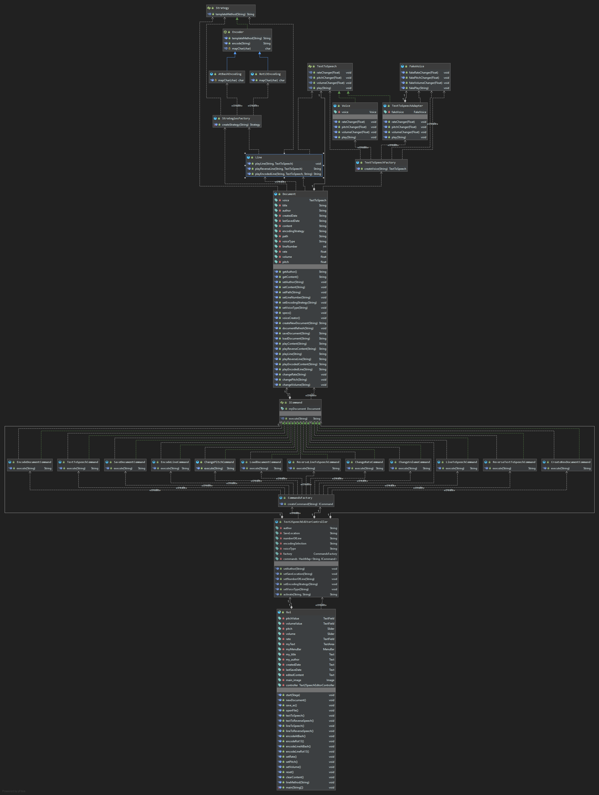

# Text to Speech Editor

## Features
- Create, Edit, and Save Documents: Users can create new documents, edit their content, and save them to disk with automatic recording of creation and save dates.

- __Text to Speech Conversion__: Convert the entire document or selected lines into speech.

- __Reverse Speech__: Transform the text into speech in reverse order (last word first).

- __Encoding Techniques__: Encode the text using Atbash or Rot-13 encoding before converting it to speech.

- __Audio Parameter Tuning__: Adjust the volume, speech rate, and pitch of the speech output.

## User Stories
The following user stories were implemented in the project:

[US-1]: As a user, I want to create a new empty document, by giving its title and author. The application should automatically record the creation date.

[US-2]: As a user, I want to edit the contents of the document, via the application's user interface.

[US-3]: As a user, I want to save the contents of the document to disk by providing a particular filename. The application should automatically record the save date.

[US-4]: As a user, I want to open the contents of an existing document from disk by providing a particular file path, or by browsing the file system folders.

[US-5]: As a user, I want to transform the contents of the document to speech.

[US-6]: As a user, I want to select a line and transform it to speech.

[US-7]: As a user, I want to transform the contents of the document to speech in reverse, i.e., play the last word of the last line first and so on.

[US-8]: As a user, I want to select a line and transform it to speech in reverse, i.e., play the last word first and so on.

[US-9]: As a user, I want to encode the contents of the document and then transform them to speech.

[US-10]: As a user, I want to select a line, encode it, and transform it to speech.

[US-11]: As a user, I want to tune the text encoding technique. The application supports the following encoding strategies:

- Atbash: The Atbash cipher maps the alphabet to its reverse (e.g., A → Z, B → Y).

- Rot-13: Rot-13 replaces a letter with the 13th letter after it in the alphabet (e.g., A → N, B → O).

[US-12]: As a user, I want to be able to tune the audio parameters, i.e., the volume, the speech rate, and the pitch.

## Design Patterns
The project was developed using the __Model-View-Controller (MVC)__ design pattern to separate the application's logic, user interface, and data handling. 
Additionally, the following design patterns were implemented:

- __Command Pattern__: Used to encapsulate actions (e.g., creating a document, saving, encoding, etc.) as objects.

- __Factory Pattern__: Used to create objects for commands, encoding strategies, and text-to-speech components.

- __Strategy Pattern__: Used to implement different encoding strategies (Atbash and Rot-13).

-  __Template Method Pattern__: Used to define the skeleton of an algorithm in a method

- __Adapter Pattern__: Used to bridge incompatible interfaces.

## Project Structure
The project is organized into the following packages:

__Model__: Contains classes responsible for managing the document data and text-to-speech functionality.

__View__: Contains the GUI classes for user interaction.

__Controller__: Handles the communication between the Model and View, and manages user commands.

## UML Diagram
Below is the UML diagram for the project, illustrating the class structure and relationships:

## Testing
The project includes unit tests for various user stories, such as creating a new document, saving and loading documents, and transforming text to speech. The tests are located in the tests directory.
